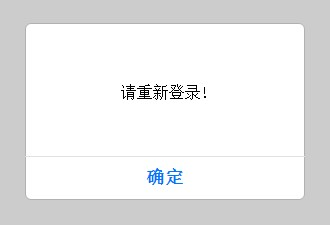
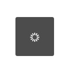
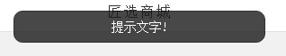
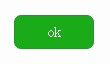
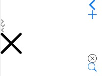
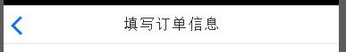
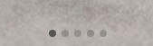
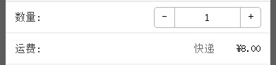

# Febs React Component

> A component framework for React Native / React Web.


[](https://nodei.co/npm/febs-react-component/)

# Install

Use npm to install:

```js
npm install febs-react-component --save
```
  It will copy directory `node_modules/febs-react-component` to `node_modules/react-component`

# Example

  see the files in path: ./demo/*.*
  ```js
  import React, { Component } from 'react';
  import { AppRegistry, StyleSheet, } from 'react-native';

  import { Navigator } from '../index'

  class app extends Component {
    render() {
      return (
        <Navigator
          ref='nav'
          defaultTitle={{ text: 'Title', }}
          defaultLeftButton={{ text: 'Back', }}
          defaultRightButton={{ text: 'Forward', onPress:()=>this.refs.nav.pop() }} 
          defaultBarTintColor='#2112'
          configureScene={(route, routeStack) => Navigator.SceneConfigs.FloatFromBottom}
          initialRoute={{
            title:    {text: 'My Initial Scene'}, 
            component:Page    // Page中可以使用 props. 来操作.
          }}
        />
      );
    }
  }

  const styles = StyleSheet.create({});
  AppRegistry.registerComponent('app', () => app);
  ```

# React Native/Web compatible

see [demo](./demo).

## Components

* AlertView

    
    
    

* Button

    

* Icons

    

* Navigator

    

* Page

    

* RefreshListView    (from npm)
* RefreshScrollView  (from npm)
* TableViewCell

    

* TimerMgr
    
    timer管理; 可以在页面销毁时自动销毁存在的timer
    统一封装 requestAnimationFrame / cancelAnimationFrame 方法
